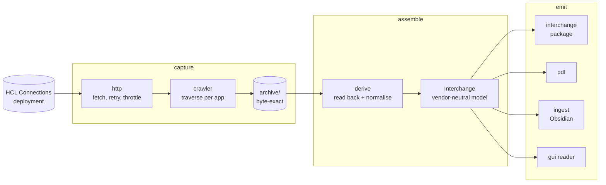
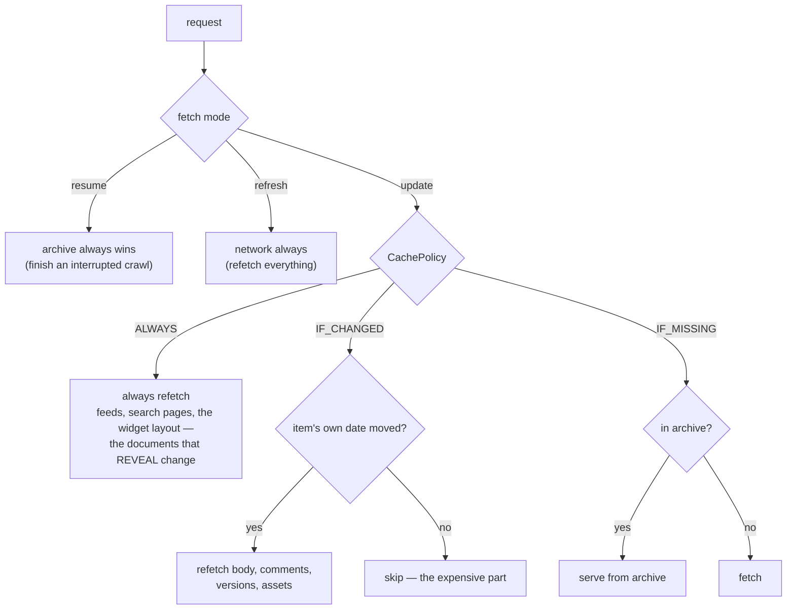
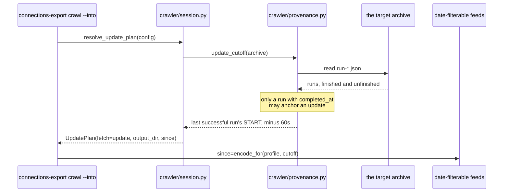
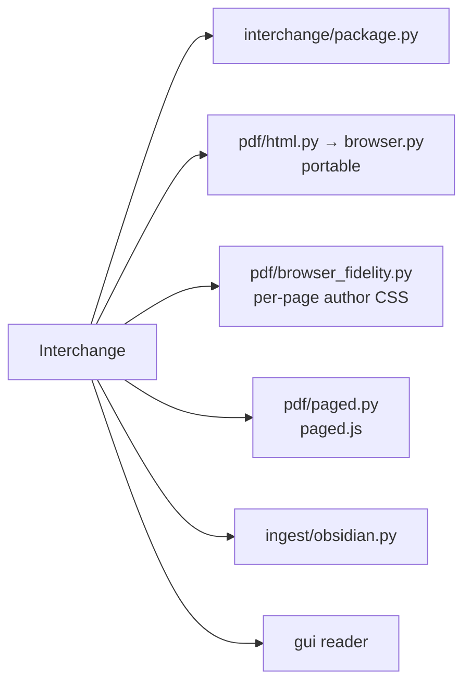

# connections-export — architecture

How the tool is put together, and why it is shaped this way. It is written for
someone reading the source: every claim here points at code you can open.

The companion document is [interchange-format.md](interchange-format.md),
which specifies the package this produces. That one is a contract for people
writing other tools; this one is about the machinery that fills it.

---

## 1. What it is

`connections-export` reads content out of an HCL Connections deployment and
writes it somewhere that outlives the deployment: wikis, blogs, forums, file
libraries and community front pages, captured byte-exactly and then assembled
into a portable, self-describing package.

Two properties shape every decision below.

**Archive-first.** The bytes a deployment returned are written to disk before
anything interprets them. Parsing, normalising and rendering all happen later,
reading from that archive. A parser improved next year can be re-run over a
capture taken today; a deployment that is no longer reachable cannot be asked
again.

**A gap is never silent.** Anything that fails, truncates, or cannot be
resolved is recorded and surfaced. A run that lost something must not be
indistinguishable from a run that lost nothing — which is why so much of what
follows is about making absence visible rather than about making it rare.

### The two axes

Content moves along one axis and time along the other:

- **Breadth** — five applications (wikis, blogs, forums, files, community
  front pages), each with its own traversal shape, sharing one engine.
- **Freshness** — a capture can be resumed, extended with a component it
  never held, or updated so that only what changed is fetched again.

Most of the difficulty is where the two meet: an update has to know, per
application, what "changed" even means.

---

## 2. The pipeline



The arrows are one-directional and that is load-bearing. `derive` reads the
archive; it never reaches back to the deployment. The outputs read the model;
they never reach back to the archive except for blob bytes. Anything that
needs the deployment happens in `capture` or not at all.

---

## 3. Layer map and dependency rules

| Layer | Package | Knows about |
|---|---|---|
| Transport | `http/` | sockets, retries, auth strategies |
| Parsing | `adapters/` | HCL's feed shapes, per application |
| Traversal | `crawler/` | which URL to ask for next |
| Storage | `archive/` | bytes, manifests, blobs |
| Assembly | `derive/` | turning archived bytes into one model |
| Contract | `interchange/` | the portable package |
| Emission | `pdf/`, `ingest/` | rendering the model elsewhere |
| Interface | `gui/`, `cli.py` | what a person asks for |

The rule is that each layer knows only about the ones above it in that table.
`adapters/` cannot import `crawler/`; `derive/` cannot import `http/`. The
check is mechanical: a layer that needed something from below would have to
reach for a module it cannot see.

### One module per app

`crawler/apps/*.py` and `derive/apps/*.py` hold one application each. Shared
mechanics live in `crawler/engine.py` and `derive/index.py`; what differs —
which feed reveals what, how a container enumerates its items — stays in the
per-app module. The five differ more than they resemble each other, and a
single generalised traversal would be a set of conditionals wearing a
function's name.

---

## 4. The application registry

`apps.py` is the single list of what the tool can capture. Each entry carries
the component kind, its URL shapes, and how it answers "what changed".

Both interfaces read it: the CLI's `--component` and the console's checkboxes
are the same set, so a component the console can offer is one the CLI accepts,
and adding an application is one registry entry rather than a search for
everywhere the list was written out by hand.

---

## 5. Capture

### 5.1 Fetch

`http/client.py` owns one connection, a retry policy that honours
`Retry-After`, and a minimum interval between requests. An export is thousands
of requests against a system other people are using; the default pacing is
deliberate rather than incidental.

Authentication is a strategy (`http/auth.py`): Windows integrated sign-in
(SSPI), Kerberos, basic, or a pasted token. The exporter runs as a person and
sees exactly what that person can see — an export is a user's copy of what
they could already read, not an administrator's backup.

### 5.2 Traverse

`crawler/engine.py` is the shared core: `Fetcher` (fetch, archive, parse,
page-walk), `AssetCapture` (the same-origin media rule), `RunSession`, and the
issue tracker that decides a run's exit code.

Each `crawler/apps/*.py` module owns one application's traversal shape:

| App | Shape |
|---|---|
| Wikis | wikis feed → per wiki nav feed (+ the wiki's page feed as the update's date index) → per page: entry, body, comments, versions, attachments |
| Blogs | list feed → per blog: entries **+ an aggregate comments feed as the update's change index** → per post: comments |
| Forums | list feed → per forum: topics → per topic: flat replies, rebuilt into a tree |
| Files | one flat library feed + one folder feed → one download per file |
| Rich content | one persisted widget layout → one GET per initialized widget |

Hierarchy always comes from the navigation feed, never a page entry's own
`parentUuid`; where the two disagree the page records `parent_discrepancy`
rather than silently picking one.

Two of those shapes carry a **change index** — a feed read once per container
that says which items moved, so an update opens only those. A wiki cannot be
asked "what changed since", so the wiki's own page feed supplies each page's
date and the per-page entry is fetched only when that date has moved. A blog
can be asked about entries, but a comment moves neither the post nor the dated
entries feed, so each blog is separately asked which *comments* changed; a
comment naming another comment rather than a post is traced back through the
archive to the post that holds it, and only a trail leading somewhere the
archive has never seen falls back to re-reading the blog.

### 5.3 Fetch modes and cache policy

Three run modes, and a per-request policy that applies to one of them:



A policy that could override `resume` or `refresh` would make those two modes
lie about themselves, so it cannot.

`IF_CHANGED` compares the item's **own recorded date** against the live value
— content date against content date — so clock skew between this machine and
the deployment cannot cost content.

Which field that date comes from is load-bearing, and not always the obvious
one. On the community files feed `atom:updated` is the *listing's* timestamp
and changes on every read, so comparing against it makes every file look
changed; the file's own `td:modified` is the content date. Before gating on a
date, check that the field moves when the content moves and not when the feed
is read.

### 5.4 Update cutoffs

`--into <archive>` means "add to this archive": the run becomes an update,
writes where that archive lives, and takes its cutoff from that archive's own
provenance.



Four things carry weight:

- The anchor is the last successful run's **start**, not its end. An item
  edited *while* that capture was running — after its own feed page had been
  read — would otherwise fall between that run's end and this run's cutoff and
  never be seen again.
- A run that **died** must never anchor an update. Its feeds were read at
  wildly different moments and everything after the point of death was never
  looked at, so treating its start as "everything before here is captured"
  would lose that window permanently while the archive looked complete.
- **A run's stamp is a date, and its id is a filename.** A run id becomes
  `run-<id>.json`, where a colon is not legal on Windows, so `run_id_for`
  shapes the name. One string cannot do both jobs: a stamp shaped for a
  filename does not parse as a date, and every update reads the stamp back to
  compute its cutoff.
- **Every finished capture can anchor one.** `finish_run` is what writes
  `completed_at`, so every application ends its run through it, and run ids do
  not collide when a community's components are captured in the same second.

An update is also scoped to the archive it updates. The archive records the
deployment it came from (`provenance.archive_base_url`) and what it holds
(`archive-summary.json`), and the console's update path dispatches the
selected components through `dispatch.run_selection` rather than the
application a URL happened to identify. "Nothing selected" means "what this
archive holds", never "everything on the deployment".

### 5.5 Author filtering

Two passes, because filtering at derive alone would still pay to download
everything. `crawler/author_plan.py` decides which pages and threads to keep
while the crawl is still running, so body-image and attachment fetches are
skipped for content the target did not author. `derive/author_filter.py` then
narrows the assembled model.

Both compare through `identity.norm_identity()` — one normaliser, because
author matching decides what a filtered export keeps, and three
implementations of it would be three chances to keep the wrong set.

---

## 6. The archive on disk

```
archive/
  manifest.jsonl        one record per request: url, outcome, hash, run id
  feeds.jsonl           one record per feed PAGE walked
  blobs/<sha256>        response bodies, content-addressed
  run-<id>.json         provenance for one run
  archive-summary.json  what this archive holds, per component
```

Bytes are content-addressed, so the same image referenced from forty pages is
stored once and every reference resolves to it. The manifest is append-only:
a later run adds records, never rewrites them, so an archive can be read while
it is being written to and a partial capture is still a valid archive.

### Why `feeds.jsonl` exists

A feed is paginated, and derive must replay exactly the pages the crawler
walked. Reconstructing that from the manifest's URLs means guessing which
`?since=` URLs belong to which logical feed and re-implementing the crawler's
stop condition — two rules that then drift apart. The crawler knows the answer
while it walks, so it writes it down, and the replay becomes a lookup.

### Silent-truncation detection

A feed page that returns fewer items than its own `totalResults` claims, or
that stops without a `next` link while items remain, is recorded as possibly
truncated and surfaced as a warning. The failure this guards against is a
capture that looks complete and is not.

---

## 7. Derive

`derive/` reads the archive and assembles one `Interchange` model. It never
fetches.

### 7.1 `ArchiveIndex`

The read side of the archive: URL → archived bytes, plus the feed-page
sequences recorded during the crawl. Everything in `derive/` goes through it,
so there is one place that knows how an archive is laid out.

### 7.2 Replay, not re-derivation

Derive walks the feed pages the crawler recorded, in the order it recorded
them, using the same `paging.should_stop_paging` the crawler stops with. The
alternative — deriving the page sequence again from URLs — is a second
implementation of a rule that already exists, and the two versions drift.

### 7.3 Assembly and narrowing

Containers are assembled independently, then cross-linked once everything
exists: a link from the first wiki to the last forum cannot be resolved while
either is still being built. `derive/crosslink.py` upgrades a link from
"somewhere on the deployment" to "in this export" when its target is present,
in every direction and across every application — a community's front page
links into its wiki, and a wiki page can link to the front page.

Narrowing (author filter, scope) happens after assembly, so the model is
complete before anything is removed from it.

---

## 8. The interchange contract

The package is specified in [interchange-format.md](interchange-format.md),
which ships with the tool and is the document another implementer reads.

Two structural points belong here. The **manifest** (`manifest.json`) declares
what the package can support — whether threading survived, whether version
bodies are present, whether ACLs were captured — so a consumer can design its
import around what the data can actually back up rather than discovering the
gaps one at a time. And `minimum_reader_version` means a reader must **refuse**
a package built to a newer contract than it understands, which turns a future
incompatibility from silent into loud.

`ingest/obsidian.py` is the reference consumer and the proof the contract is
buildable with no HCL knowledge: it reads the normalised model and the blobs,
and nothing else.

---

## 9. Outputs



PDF has three paths because "print the wiki" means three different things:
a portable document that renders anywhere, a faithful reproduction that needs
the original stylesheets, and a paginated one with a table of contents and
running marks. They share the model and nothing else.

A browser is a runtime prerequisite rather than a Python dependency: a system
Edge or Chrome is preferred, with Playwright's bundled Chromium as a fallback,
and `CHROMIUM_AVAILABLE` reports whether any of them can actually start.

---

## 10. The console (`hcl-serve`)

A local FastAPI app plus a pure-JS front end. `gui/app.py` builds the app,
sets up state, and registers route groups:

| Module | Owns |
|---|---|
| `routes/model.py` | `/api/model`, `/api/blob/{hash}`, current archive, the spec |
| `routes/lookup.py` | Authenticated lookups: identify a URL, resolve a user, preview search, feed info |
| `routes/archives.py` | List, open, delete, ledger, match |
| `routes/settings.py` | Editable settings, PDF style preview |
| `routes/pdf.py` | `/api/pdf`, `/api/live-pdf` |
| `routes/static.py` | Console assets, demo URLs |
| `routes/run.py` | `/api/start`, `/api/stop`, `/events` (SSE) |

**Security** (`gui/security.py`): binding to 127.0.0.1 is not enough, because
a web page the user has open can be turned against a local server. `Host` is
checked against a localhost allowlist (DNS rebinding) and state-changing
requests are checked for a local `Origin` (CSRF). The guard is pure-ASGI, so
it never buffers the SSE stream.

**Progress** is a typed event stream (`crawler/events.py`) — `RunStarted`,
`Discovered`, `Fetching`, `Fetched`, `Retried`, `Failed`, per-app `*Derived`
events, `Warning`, `Pruned`, `RunComplete`. Emission is fire-and-forget
throughout via `safe_emit`: a console that has gone away must never break a
crawl.

The event stream is a **separate contract** from the interchange model. They
are read by different consumers and change for different reasons.

**A run has one end.** Every component's crawl finishes with its own
`RunComplete`, so a capture of five components emits five. Those are marked
`final: false` and the run thread emits the one authoritative end, so "the run
is over" is a fact the server states rather than one the console infers from
the first thing that looks like it. Events the run synthesizes — that end, an
internal failure — go out the same way as the crawl's own, so the archive's
`events.jsonl` holds the moment the run ended.

---

## 11. Testing

Around 2,400 tests, no network, no real deployment.

**`fakeserver/`** is what makes that possible: an in-memory synthetic
Connections API serving the documented request and response shapes at the real
URL shapes — deterministic, offline, and fault-injectable. `prototype.py`
holds the curated dataset; `content.py` supplies prose written per title, so
six posts do not read as the same post six times; `synth.py` assembles them
into feeds; `faults.py` injects status codes and truncated bodies; `app.py`
honours `since`, page sizes and per-app ceilings the way a deployment does.

The demo is the same server. `serve --demo` runs the real crawler, the real
archive, the real adapters, the real derive and the real event stream against
it — the data source is the only thing that differs from a live run, which is
what makes the demo evidence that the pipeline works rather than a picture of
it working. The console renders whatever the pipeline emits and invents
nothing, so what the demo shows is changed by editing the dataset and in no
other way.

It also has an **identity**: `profileService.do` answers "who am I", and the
demo is signed in as one of the people in its own data — chosen for authoring
in all five components, so an "only me" filter leaves something everywhere
rather than nothing. Without a principal, the identity path a real deployment
always exercises would be the one path nothing tested.

A test run must not write where a user keeps things. `tests/conftest.py`
redirects both the archives directory and the saved-settings directory per
test.

Browser-driven tests launch through the product's own `launch_browser`, so the
browser they drive is by construction the one `CHROMIUM_AVAILABLE` proved.
Launching Playwright's bundled Chromium directly would ask for a different
browser than the guard checked, which passes on any machine that has both.

---

## 12. Configuration

Layered, highest wins, merged per key:

```
CLI flags  >  environment (CONNECTIONS_EXPORT_*)  >  connections-export.toml  >  defaults
```

Secrets are never read from the file. A token or password comes from the
environment; SSPI and Kerberos need no stored secret at all, because they use
the operating system's session.

`connections-export.example.toml` documents every key with a placeholder host.

---

## 13. Invariants, and where they are enforced

| Invariant | Enforced in |
|---|---|
| A failed fetch is recorded, never omitted | `Fetcher.get_content` → `Archive.write_failure` |
| A parse error is non-fatal and archived | `parse_or_none` → `failed(kind=unparsed)` |
| A page-walk cap is surfaced, never silent | `should_stop_paging` + `pagination_cap` warning |
| Possible truncation is flagged | `Archive.report()` from `feeds.jsonl` |
| A dead run cannot anchor an update | `provenance.last_successful_run` |
| A run's own stamp is a readable date | `default_clock` + `parse_cutoff` |
| Every finished capture can anchor an update | `finish_run`, in every application |
| Two runs in the same second keep their own records | `engine._free_run_id` |
| An update touches only what the archive holds | `routes/run.archive_scope` → `dispatch.run_selection` |
| An update never runs the demo into a real archive | `routes/run.py` refuses |
| Stop ends the run, not the container it is inside | outer-loop checks in every application |
| A run declares itself over exactly once | `run_complete.final` |
| Derive reads back every page the crawler walked | `feeds.jsonl` replay |
| A package contains every blob it declares | `derive/traverse.iter_all_assets`, used by manifest **and** package writer |
| The CLI accepts every kind the console emits | `apps.COMPONENT_KINDS` |
| A cutoff is never sent to a feed that ignores it | `AppSpec.accepts_since` + `since.encode_for` |
| The shipped spec documents every model field | `test_manual_interchange_spec` |
| A change-revealing document is refetched in `update` mode | `CachePolicy.ALWAYS` on every list feed and layout |
| Links resolve across every application, in both directions | `derive/crosslink._entities` |
| Tests never write the user's archives or settings | `tests/conftest.py` |

Each row is a property with a test that fails when it stops holding. A guard
that searches for a word rather than counting the things it guards is not a
guard.
